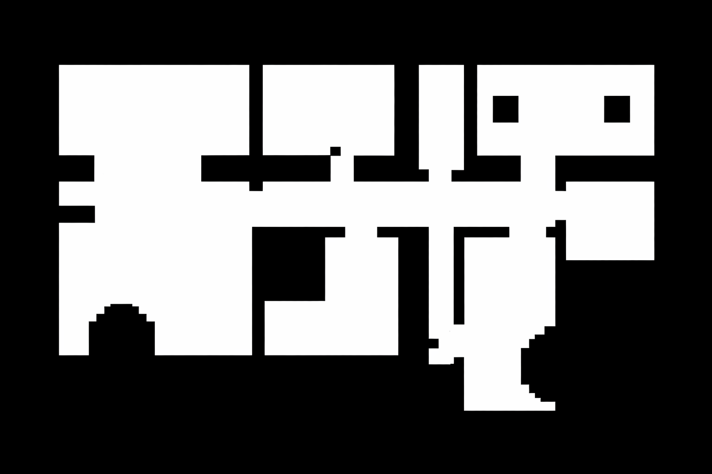

<h1 align="center">Zadanie 1: Simulácia mobilného robota</h1>
<h3 align="center">Časť 1 - Simulované prostredie </h3>

  Tento projekt implementuje 2D simulátor robota v jazyku C++, v ktorom sa robot s diferenciálnym pohonom pohybuje v mape a skenuje svoje okolie pomocou lidaru

<h2>🗺️ Mapa prostredia</h2>

  Náš robot sa pohybuje v 2D mriežke načítanej z PNG obrázka[cite: 15]. Ukážka mapy, v ktorej bude simulácia prebiehať:

  
   
  <em>Čierny pixel (hodnota 0) predstavuje prekážku, biely pixel (hodnota 255) je voľný priestor.</em>

<h2>🏗️ Architektúra a rozhrania</h2>

<h3>1. Základné dátové typy (<code>Geometry.h</code>)</h3>
<ul>
  <li><strong>Point2d:</strong> 2D bod definovaný súradnicami (x, y).</li>
  <li><strong>Twist:</strong> Lineárna a uhlová rýchlosť robota (linear, angular).</li>
  <li><strong>RobotState:</strong> Kompletný stav robota obsahujúci polohu (x, y), orientáciu (theta) a rýchlosť (velocity typu Twist).</li>
</ul>

<h3>2. Simulované prostredie (<code>Environment</code>) </h3>

  Prostredie sa načítava pomocou knižnice OpenCV (ako obrázok v odtieňoch sivej <code>CV_8UC1</code>). 
  Trieda <code>Environment</code> poskytuje metódu <code>isOccupied(x, y)</code>, ktorá vracia informáciu o tom, či sa na danej súradnici nachádza prekážka.

<h3>3. Simulácia Lidar (<code>Lidar</code>) </h3>

  Senzor Lidar vysiela <code>beam_count</code> lúčov, ktoré sú rovnomerne rozložené medzi uhlami <code>first_ray_angle</code> a <code>last_ray_angle</code>. 
  Každý lúč je vyslaný relatívne voči orientácii robota a posúva sa po malých krokoch až do vzdialenosti <code>max_range</code>. 
  Ak lúč narazí na prekážku, uloží sa bod zásahu. Metóda <code>scan()</code> následne vracia vektor týchto bodov v súradnicovom systéme mapy.

<h3>4. Vizualizácia a Demo aplikácia (<code>Canvas</code>) </h3>

  Trieda vykresľuje mapu prostredia, aktuálnu polohu robota a lúče/body z Lidar skenu pomocou OpenCV (napr. <code>cv::imshow</code>, <code>cv::circle</code>, <code>cv::line</code>)
  Súčasťou je interaktívna demonštrácia, kde je možné pridať nový bod napríklad kliknutím myšou, z klávesnice, alebo načítaním z textového súboru.

<h2>✅ Úlohy a bodovanie </h2>
<ul>
  <li>Vytvorenie projektu a <code>CMakeList.txt</code> (knižnica, binárny súbor, aspoň jeden unit test) - <strong>1 b</strong>.</li>
  <li><strong>Environment:</strong> Načítanie mapy a implementácia funkcie <code>isOccupied()</code> - <strong>1 b</strong>.</li>
  <li><strong>Lidar:</strong> Implementácia simulácie Lidar metódou <code>scan()</code> - <strong>1 b</strong>.</li>
  <li><strong>Vizualizácia a demo:</strong> Správne vykreslenie prostredia - <strong>1 b</strong>.</li>
  <li><strong>Interaktívna aplikácia:</strong> Podpora viacerých pozícií s lidarovými bodmi - <strong>1 b</strong>.</li>
</ul>
